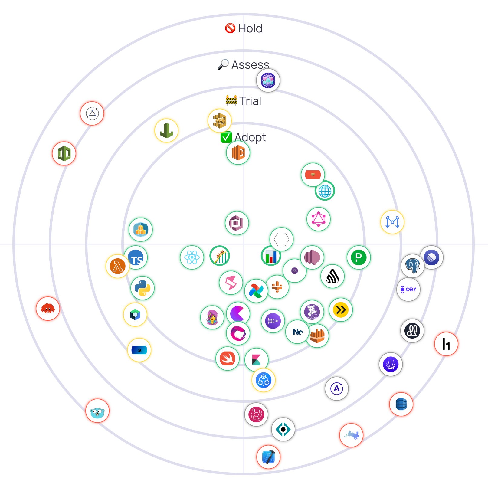

# Choco Tech Radar 📡



Choco's take on the [Tech Radar](https://www.thoughtworks.com/radar). 

We believe making this public both increases internal visibility of our Radar and allows prospective candidates to sneak peak what we're working with or reserching.

## Developing

```sh
yarn
yarn start
```

## Updating & deploying

We use our internal Notion Tech Radar as the source of truth for the content. The `update` script will download the content from Notion and format it for the radar. To update this repo run:

```sh
NOTION_TOKEN=secret_d1a6... yarn update
```

Then push & deploy with:

```sh
yarn deploy
```

## Choco open source 

<div style="background: rgba(0, 0, 50, 0.1)">

- [Contributing](./docs/CONTRIBUTING.md)
- [Code of Conduct](./CODE_OF_CONDUCT.md)
- [License](./LICENSE.md)
- [Security](./docs/SECURITY.md)
- [Changelog](./CHANGELOG.md)

</div>
